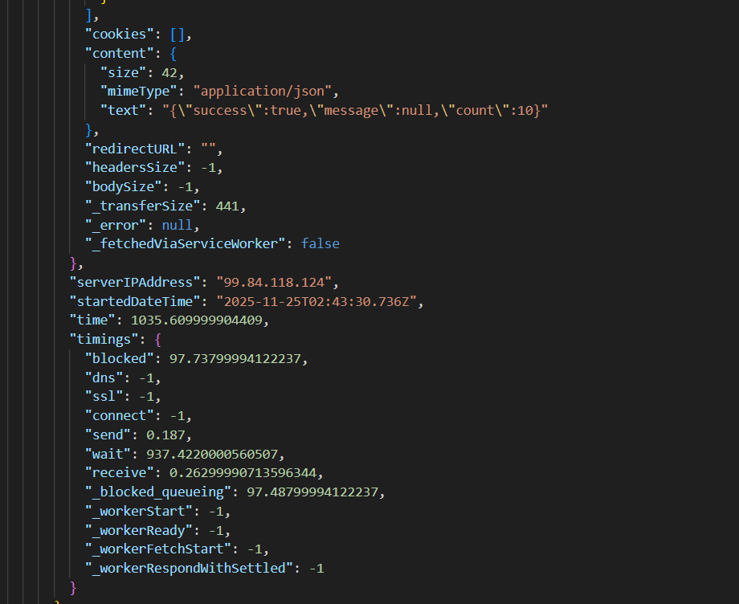

# Curiosity Report: HAR Files
## Why I Chose This Topic:
In our class, for our load testing deliverable, we uploaded a HAR file to Grafana to help us get a good jumpstart on our K6 tests. I was extremely curious as to what this file actually was because we just brushed over it, and it seemed to do a lot for us. I knew this tracked our requests done on the browser, but I wanted to know more, including what these files could be used for and what they all contain.
## What is a HAR File
A HAR file is a JSON-formatted log of all network requests and responses between a web browser and a website. This file is primarily used by developers for troubleshooting website performance and debugging possible issues like slow load times, network problems, or failed requests. It does this by providing information about the page's resources, timing, headers, and cookies. 
## What a HAR file contains
- **Requests and Responses:** Full details of every HTTP request and response, including headers, status codes, and cookies during a recording. 
- **Timing:** Detailed timing information for each resource, showing how long it took to load.
- **Payload data:** The content or body of the requests and responses.
- **Other metrics:** Information like the size of resources and other performance-related data.
## What can a HAR file be used for:
- **Debugging performance:** These files can help developers analyze what could be happening in a website to find bottlenecks, diagnose slow load times, and identify inefficient code or assets.
- **Troubleshooting issues:** Support teams may use HAR files downloaded by users to help them replicate and debug a specific bug or error encountered on a website.
- **Analyze authentication:** It can be used to see the sequence of redirects and requests during a login to troubleshoot authentication problems
- **Visualizing traffic:** A HAR file can be viewed to easily visualize and analyze the captured data off of a website.
## Example
In my example, I was really curious to know what a HAR file would look like that wasn't based on our pizza jwt website. So, instead, I used a website I am building and modifying in my CS340 class instead. This website is known as Tweeter and is a very simplified version of what used to be known as Twitter, now X. It is a social media website to show things like followers and followees and different posts that users put out. For this example, I logged a user logging in, making and posting something, and then logging out. Here is the UI to understand what I was messing with:

From logging in, posting a status, and logging out, this file was generated: [Click Here](../Tweeter_HAR.har)
- Here is a snippet of
  - the request logging code: 
  - the response logging code: 
  - more response code including content and other content: 
### Example Summary
I really loved learning more about the actual content of HAR files through looking at the HAR file I generated above, and through looking at the one we generated in class in more detail. From looking at these I have learned how using these files can really give good insight into understanding the performance of a website regarding api calls.
## Fun Facts
- You can generate a HAR file from **all** major browsers
- The directions to generate a HAR file in a broswer is generally the same:
  1. Open the Developer Tools
  2. Open the Network tab.
  3. Preserve logging (optional but recommended)
  4. Perform your actions.
  5. Find the download HAR button/ save all as HAR.
  In Safari, go to settings, then advanced, and check show menu in menu bar, then proceed with instructions.
## Conclusion
It has been fascinating to know how HAR files work, what's in them, and when to use them. While in this class we used them for load testing setup, they really can be a helpful tool for any developer. From my research, it seems easiest to just look at the network tab in developer tools to analyze api request and response to see what happens. However, I do think that this can be a great tool to look even further into a website if you need more answers, want to analyze more data, and you aren't getting what you are looking for simply through the developer tools. I think these files can really help in analysis and debugging. 

