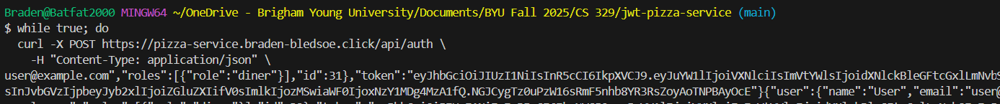
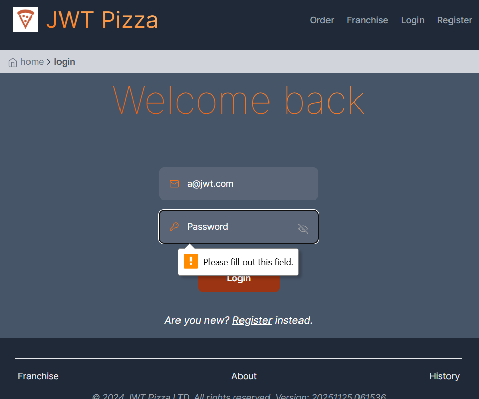
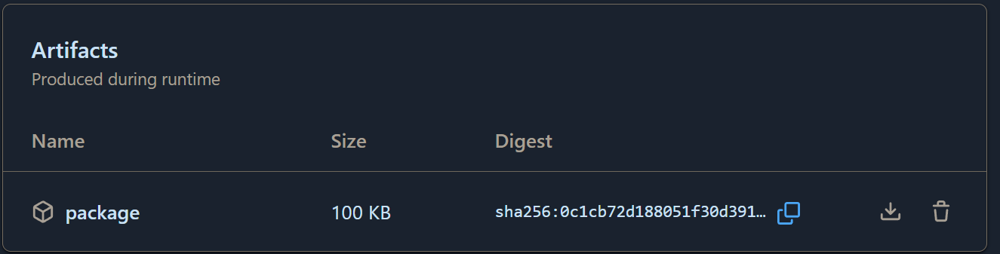
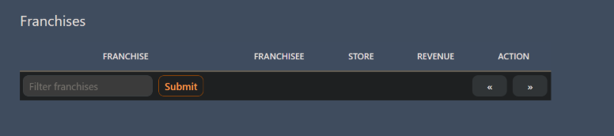
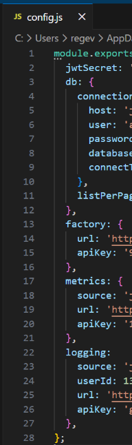

# Penetration Testing                                               
- #### Braden Bledsoe and Evan Scott
## Self attack
### Attack 1
| Item           | Result                                                                         |
| -------------- | ------------------------------------------------------------------------------ |
| Date           | December 6, 2025                                                               |
| Target         | pizza.braden-bledsoe.click                                        |
| Classification | Unrestricted Resource Consumption (DoS) / Lack of Rate Limiting                  |
| Severity       | 2                                                                              |
| Description    | For basically any of my api endpoints i was able to do the call as many times as I wanted to and there was no cap.                |
| Images         |  |
| Corrections    | I can create limits within my actual code to prevent such measures. This is especially important for continually creating or deleting items.             |

### Attack 2
| Item           | Result                                                                         |
| -------------- | ------------------------------------------------------------------------------ |
| Date           | December 6, 2025                                                               |
| Target         | pizza.braden-bledsoe.click                                        |
| Classification | Authentication injection                 |
| Severity       | 0                                                                              |
| Description    | I was testing to see if on the site you could enter empty passwords and possibly that was a way to log in to different users without knowing their passwords. The result was that just a ui error popup would should, so it wouldn't let me do that.               |
| Images         |  |
| Corrections    | None. This works correctly and doesn't allow empty password injections.            |

## Peer attack
### Peer 1 - Braden's Attacks
### Attack 1
| Item           | Result                                                                         |
| -------------- | ------------------------------------------------------------------------------ |
| Date           | December 6, 2025                                                               |
| Target         | pizza.risesocial.click                                        |
| Classification | Authentication logic flaw / Duplicate account creation                         |
| Severity       | 1                                                                              |
| Description    | The system allowed registering the same user credentials multiple times. This resulted in duplicate accounts tied to the same email, and I was able to log in with each of them.                |
| Images         | n/a |
| Corrections    | Enforce uniqueness constraints on the email field at both the database and application logic level. Only one account should be allowed per email address.                                                         |
### Attack 2
| Item           | Result                                                                         |
| -------------- | ------------------------------------------------------------------------------ |
| Date           | December 6, 2025                                                               |
| Target         | pizza.risesocial.click                                              |
| Classification | Access control enforcement / Unauthorized access attempt                        |
| Severity       | 0                                                                         |
| Description    | Attempted to query franchise data directly via curl. The request was denied with an “Access Denied” error, showing that authentication and authorization controls are properly enforced.                |
| Images         | n/a |
| Corrections    | No changes needed. Endpoint correctly requires authentication and prevents unauthorized access.                                                       |
### Attack 3
| Item           | Result                                                                         |
| -------------- | ------------------------------------------------------------------------------ |
| Date           | December 6, 2025                                                               |
| Target         | pizza.risesocial.click                                             |
| Classification | Information disclosure attempt / CI/CD artifact inspection                        |
| Severity       | 0                                                                              |
| Description    | Downloaded a build artifact from GitHub Actions and inspected configuration files. Sensitive values were protected by environment variables, so no secrets were exposed.           |
| Images         |  |
| Corrections    | No changes needed. Using environment variables for secrets is a secure practice. Ensure artifacts are not publicly accessible if they contain sensitive build outputs.                                                         |
### Attack 4
| Item           | Result                                                                         |
| -------------- | ------------------------------------------------------------------------------ |
| Date           | December 6, 2025                                                               |
| Target         | pizza.risesocial.click                                             |
| Classification | Privilege escalation / Default credential abuse                        |
| Severity       | 2                                                                              |
| Description    | Logged in using the default admin account provided in the original repository template. This granted full administrative access, including the ability to add or delete users, franchises, and stores. |

### Peer 2 - Evan's Attacks
### Attack 1
| Item           | Result                                                                         |
| -------------- | ------------------------------------------------------------------------------ |
| Date           | December 6, 2025                                                     |
| Target         | pizza.braden-bledsoe.click                                        |
| Classification | Improper Input Validation / Database Integrity Failure                       |
| Severity       | 2                                                                         |
| Description    | Attempt: Registering the same user credentials multiple times. Result: Was able to register with it multiple times. Was able to log in with credentials that had been registered multiple times. |
| Images         | n/a |
| Corrections    |  Database Schema Update: Add a UNIQUE constraint or index to the email column in your MongoDB or SQL user table. This ensures the database engine rejects duplicates at the lowest level. Backend Validation: In the register endpoint, query the database for the email before attempting to create the new user. If it exists, return a 409 Conflict error. |

### Attack 2
| Item           | Result                                                                         |
| -------------- | ------------------------------------------------------------------------------ |
| Date           | December 6, 2025                                                     |
| Target         | pizza.braden-bledsoe.click                                        |
| Classification | Security Misconfiguration / Information Disclosure                       |
| Severity       | 1                                                                         |
| Description    | Attempt 1: Used curl command to hit get franchises endpoint: curl -X GET "https://pizza-service.braden-bledsoe.click/api/franchise?page=0&limit=3&name=*"   -H "Content-Type: application/json" {"franchises":[{"id":1,"name":"pizzaPocket","stores":[{"id":1,"name":"SLC"}]}],"more":false} Result: Was able to successfully access a list of franchises and their stores. Potentially an exploit if this information was not intended to be public. Could be used for a social engineering attack. |
| Images         | n/a |
| Corrections    |  Access Control: If this data is sensitive, add the authRouter.authenticateToken middleware to the route.Sanitize Output: Ensure the API only returns necessary public info (e.g., store names/addresses) and strips out internal IDs or admin-specific metadata if not needed by the frontend. |

### Attack 3
| Item           | Result                                                                         |
| -------------- | ------------------------------------------------------------------------------ |
| Date           | December 6, 2025                                                     |
| Target         | pizza.braden-bledsoe.click                                        |
| Classification | Broken Access Control / Missing Function Level                 |
| Severity       | 4                                                                         |
| Description    | Attempt 2: Actually, I didn't need the franchise name because I could have gone through the IDs (1-10) if if had wanted to delete franchises because the route called for an ID, not a name. Delete franchise route was missing authentication. curl -X DELETE "https://pizza-service.braden-bledsoe.click/api/franchise/1"   -H "Content-Type: application/json" {"message":"franchise deleted"} Result: Was able to successfully delete all franchises and therefore impair the store query and customers could no longer order pizzas through the website.  |
| Images         |   |
| Corrections    |  Authentication & Authorization: Add the authentication middleware (req.user) AND an admin role check. |

### Attack 4
| Item           | Result                                                                         |
| -------------- | ------------------------------------------------------------------------------ |
| Date           | December 6, 2025                                                     |
| Target         | pizza.braden-bledsoe.click                                        |
| Classification | Sensitive Data Exposure / Hardcoded Secrets                      |
| Severity       | 3                                                                         |
| Description    | Attempt: Pull config file from github artifacts action package on public repo. Result: Was able to successfully obtain all application secrets.     |
| Images         |  |
| Corrections    |  Environment Variables: Do not include .env or config.json files in your build artifacts. Use GitHub Actions "Secrets" to inject these values only at runtime or during the deployment step. Gitignore: Ensure your config files are in .gitignore. Artifact Hygiene: Configure your upload-artifact step to specifically exclude configuration files or source maps that might contain secrets. |

### Attack 5
| Item           | Result                                                                         |
| -------------- | ------------------------------------------------------------------------------ |
| Date           | December 6, 2025                                                     |
| Target         | pizza.braden-bledsoe.click                                        |
| Classification | Unrestricted Resource Consumption (DoS) / Lack of Rate Limiting            |
| Severity       | 2                                                                         |
| Description    | Attempt: Simulate traffic for account creations and pizza orders to muddy the database. Result: Was able to send curl requests without restriction. |
| Images         | n/a |
| Corrections    |  Rate Limiting Middleware: Implement a library like express-rate-limit in your main index.js file. |

### Attack 6
| Item           | Result                                                                         |
| -------------- | ------------------------------------------------------------------------------ |
| Date           | December 6, 2025                                                     |
| Target         | pizza.braden-bledsoe.click                                        |
| Classification | Broken Object Property Level Authorization (Mass Assignment) / Integrity Violation   |
| Severity       | 3                                                                         |
| Description    | Attempt: Send pizza order directly to order API and change price. // getMenu orderRouter.get( '/menu', asyncHandler(async (req, res) => { res.send(await DB.getMenu()); })); “ // createOrder orderRouter.post( '/', authRouter.authenticateToken, asyncHandler(async (req, res) => { const orderReq = req.body; const order = await DB.addDinerOrder(req.user, orderReq);” “example: `curl -X POST localhost:3000/api/order -H 'Content-Type: application/json' -d '{"franchiseId": 1, "storeId":1, "items":[{ "menuId": 1, "description": "Veggie", "price": 0.00001 }]}'`, Result: Was able to successfully purchase a pizza for any price. |
| Images         | n/a |
| Corrections    |  Trust Source of Truth: Never trust the price sent in req.body. Backend Logic: In your createOrder endpoint, iterate through the items array sent by the user. Use the menuId to fetch the actual price from your database (the source of truth) and calculate the total server-side. |

### Attack 7
| Item           | Result                                                                         |
| -------------- | ------------------------------------------------------------------------------ |
| Date           | December 6, 2025                                                     |
| Target         | pizza.braden-bledsoe.click                                        |
| Classification | Use of Hardcoded Credentials / Security Misconfiguration   |
| Severity       | 4                                                                         |
| Description    | Attempt: Pulled admin credentials from default database population script. Result: Was able to gain admin access. |
| Images         | n/a |
| Corrections    |  Remove Hardcoded Secrets: Never put actual passwords in your seed.js or database population scripts, especially if they are committed to GitHub. Use Environment Variables: Modify the script to read the initial admin password from an environment variable (e.g., process.env.ADMIN_PASSWORD). Credential Rotation: Immediately change the leaked admin password in the production database. Force Password Change: Implement logic that flags the default admin account to require a password reset upon the very first login. |

## Combined summary of learnings
