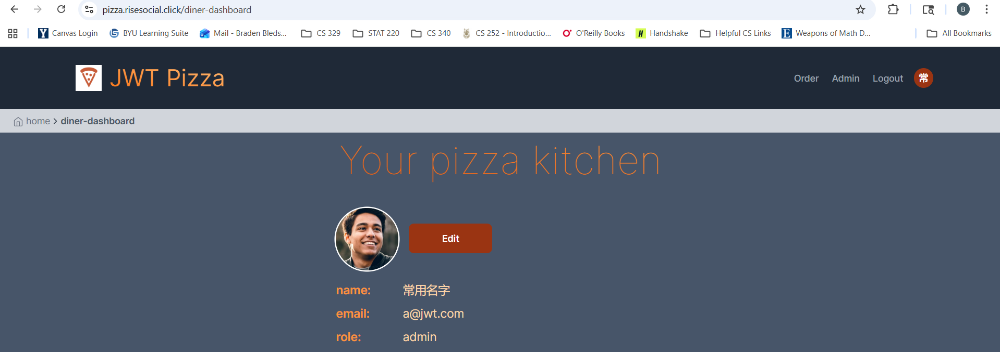

# Penetration Testing                                               
- #### Braden Bledsoe and Evan Scott
## Self attack

## Peer attack
### Peer 1 - Braden's Attacks
### Attack 1
| Item           | Result                                                                         |
| -------------- | ------------------------------------------------------------------------------ |
| Date           | December 6, 2025                                                               |
| Target         | pizza.risesocial.click                                        |
| Classification | Authentication logic flaw / Duplicate account creation                         |
| Severity       | 1                                                                              |
| Description    | The system allowed registering the same user credentials multiple times. This resulted in duplicate accounts tied to the same email, and I was able to log in with each of them.                |
| Images         | n/a |
| Corrections    | Enforce uniqueness constraints on the email field at both the database and application logic level. Only one account should be allowed per email address.                                                         |
### Attack 2
| Item           | Result                                                                         |
| -------------- | ------------------------------------------------------------------------------ |
| Date           | December 6, 2025                                                               |
| Target         | pizza.risesocial.click                                              |
| Classification | Access control enforcement / Unauthorized access attempt                        |
| Severity       | 0                                                                         |
| Description    | Attempted to query franchise data directly via curl. The request was denied with an “Access Denied” error, showing that authentication and authorization controls are properly enforced.                |
| Images         | n/a |
| Corrections    | No changes needed. Endpoint correctly requires authentication and prevents unauthorized access.                                                       |
### Attack 3
| Item           | Result                                                                         |
| -------------- | ------------------------------------------------------------------------------ |
| Date           | December 6, 2025                                                               |
| Target         | pizza.risesocial.click                                             |
| Classification | Information disclosure attempt / CI/CD artifact inspection                        |
| Severity       | 0                                                                              |
| Description    | Downloaded a build artifact from GitHub Actions and inspected configuration files. Sensitive values were protected by environment variables, so no secrets were exposed.           |
| Images         |  |
| Corrections    | No changes needed. Using environment variables for secrets is a secure practice. Ensure artifacts are not publicly accessible if they contain sensitive build outputs.                                                         |
### Attack 4
| Item           | Result                                                                         |
| -------------- | ------------------------------------------------------------------------------ |
| Date           | December 6, 2025                                                               |
| Target         | pizza.risesocial.click                                             |
| Classification | Privilege escalation / Default credential abuse                        |
| Severity       | 2                                                                              |
| Description    | Logged in using the default admin account provided in the original repository template. This granted full administrative access, including the ability to add or delete users, franchises, and stores. |
| Images         |  |
| Corrections    | Remove or disable default admin accounts before deployment. If an admin account is required, enforce strong, unique credentials and rotate passwords. Consider implementing role-based access control and monitoring for suspicious admin activity.                                                                                            |
## Combined summary of learnings
